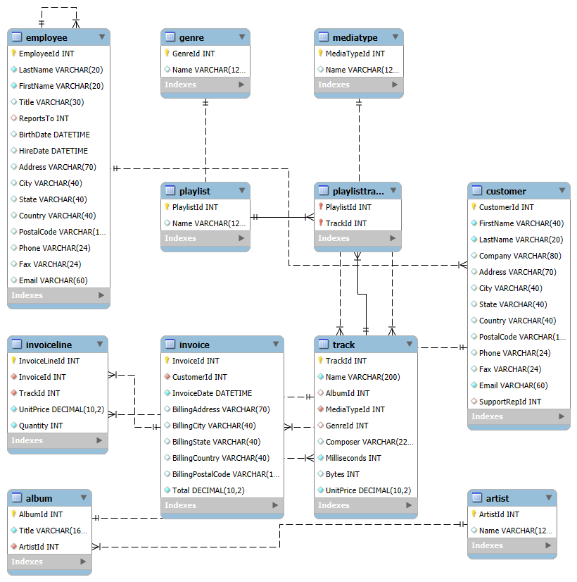
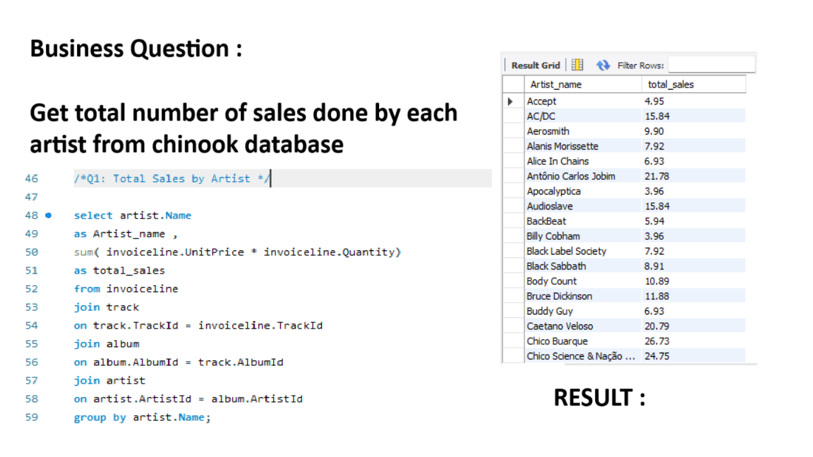
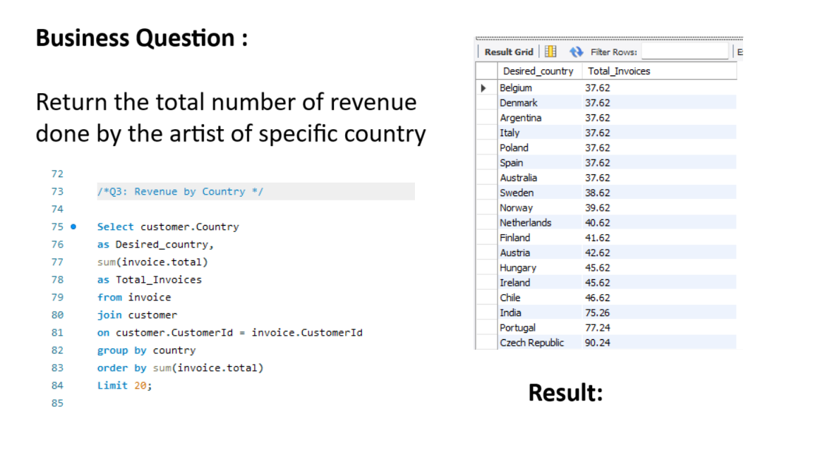

# 🎵 Chinook SQL Analysis Project

This project uses the Chinook music store database to answer key business questions using SQL.

## Schema Diagram:

Created by Yash Bamne

## 🔧 Tools Used:
- MySQL Workbench
- Chinook Sample Database

## 📊 Business Questions Answered:
- Total sales by artist
- Most purchased album
- Revenue by country
- Average posts per user (engagement)
- Detection of unusual user behavior (e.g., bots)

## 💡 Key SQL Concepts:
- SELECT, WHERE, ORDER BY
- JOINs (INNER, LEFT)
- GROUP BY, HAVING
- Subqueries, CASE WHEN

## Output Preview:

Created by Yash Bamne
